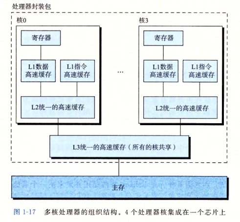


一句话说并发的目的：我们想让计算机做的更多，运行的更快。


<!-- more -->

---

## 前言

如果你对以下概念存有疑惑，那么你很适合读这篇总结性文章：

- 并发、并行
- 处理器、CPU、核
- 线程级并发、指令级并行、单指令&多指令并行

整理的可能不够详细，若想进一步了解，请参考CSAPP3.0 P17-P19。

## 概念

> 驱动数字计算机进步的两个需求是**想要计算机做得更多**、**想让计算机运行的更快**，相关的两个术语便是*并行*和*并发*。（这两个术语有好几种说法，不过是一个代称而已，理解真正的意思就好了。）



### 并发

是一个通用的概念，指一个同时具有多个活动的系统具有的特性。





### 并行

指的是用并发来使系统运行得更快。



## 线程级并发

> 构建在进程的抽象上。

### 处理器分类

#### 单处理器


真正的单CPU、单线程，处理器同一时刻只能执行一个线程。它的并发是模拟出来的，是通过进程间快速切换实现的。

- 不惜切换上下文浪费资源来实现模拟并发是为了缩短前台程序响应时间，能够同时运行多个程序，提高用户体验。



#### 多处理器
> 多处理器包含***多核处理器***和***超线程处理器***。



随着多核处理器和超线程的出现，使得多处理器变得常见。



##### 0x01 多核处理器

> **“核”正是指的CPU**。



多核处理器是将多个CPU（称为“核”）集成到一个集成电路芯片上。

> 以下是一个典型的多核处理器

- 每一个CPU（即“核”）可以执行一个线程
- 每个核都有自己的L1和L2级Cache
- L1级Cache分为两个部分，一个保存最近取到的指令，一个存放数据
- 所有核共享L3级Cache



##### 0x02 超线程处理器



有时称为**同时多线程**，是一项允许一个CPU多个控制流（线程）的技术。

- 涉及CPU某些硬件的多个备份，比如程序计数器（PC或IP）和寄存器文件
- 常规处理器需要20000个时钟周期做不同线程间的转换，而超线程处理器可以在单个线程决定执行哪个线程（当一个线程处于“慢”状态，比如等待数据从内存装到Cache中时，可以选择处于“快”状态的线程先执行）



##### 0x03 Intel Core i7 的四核八线程指什么？



即将4个CPU（也就是“核”）集成到一个集成电路芯片上，每个CPU允许控制2个控制流（线程）



## 指令级并行
> 构建在较低的抽象层次上。



现代处理器可以同时执行多条指令的属性称为指令级并行。

- 1978年Intel8086，需要多个（通常是3~10个）时钟周期来执行一条指令。
- 现代处理器可以达到每个时钟周期处理2~4条指令，但每个指令周转时间需要20个时钟周期或更长。主要是因为处理器使用了一些技巧可以同时处理多达100条指令。



## 单指令、多数据并行
> 构建在最低层次上。



许多现代处理器拥有特殊的硬件，允许一条指令产生多个可以并行的操作，这种方式称为单指令、多数据，即SIMD并行（Single Instruction Multiple Data）

- 例如，较新的几代Intel和AMD处理器都具有并行地对8位点精度浮点数（C语言的float）做加法的指令



## 总结

本篇文章用于回顾（retrospect）和总结，避免遗忘。
