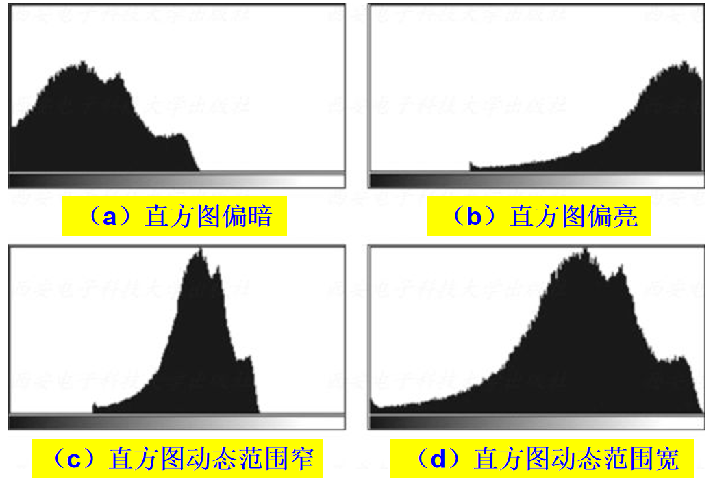
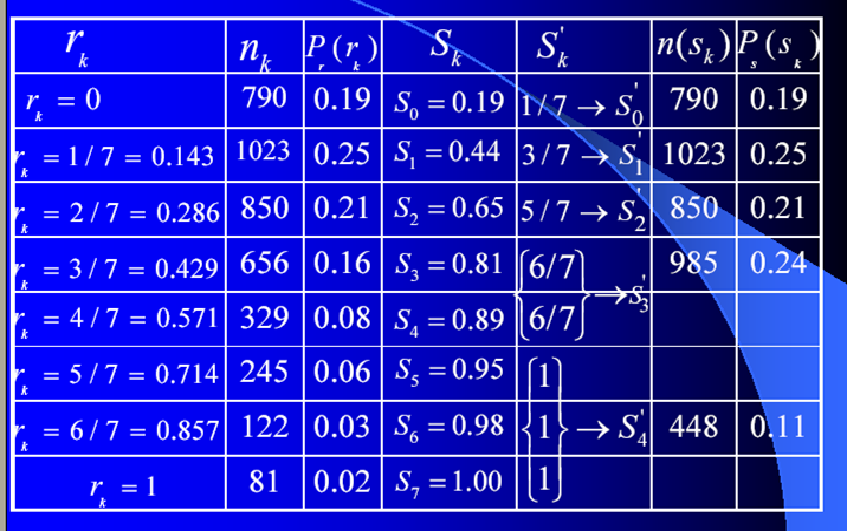
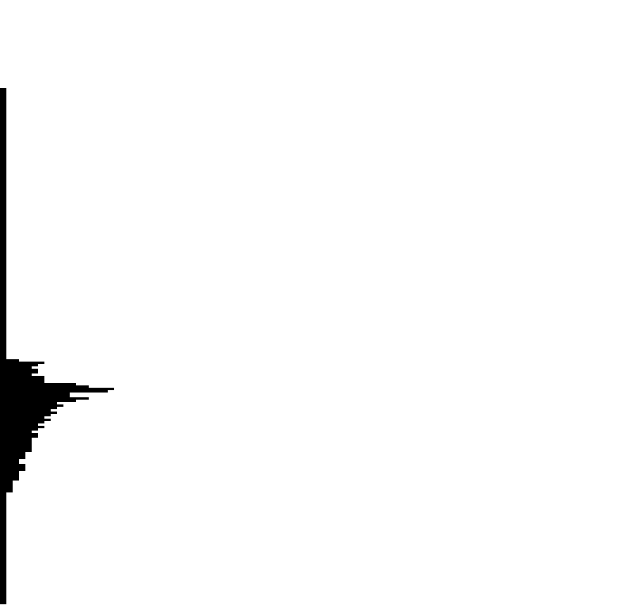
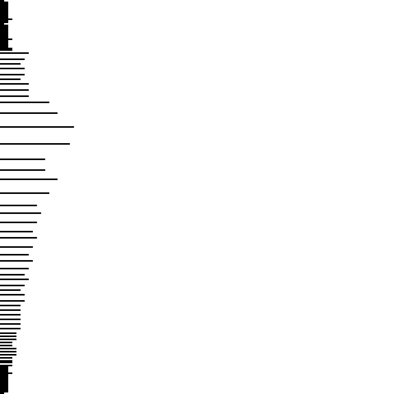



就像望远镜之于天文学，计算机科学不仅仅是计算机。—— Edsger Dijkstra



<!-- more -->

---


## 前言

了解了BMP文件的格式，下面就开始真正的进行图像处理了，首先是图像增强，本文主要写灰度直方图和根据灰度直方图均衡化8位灰度图


## 直方图统计


### 什么是灰度直方图


灰度直方图用于显示图片各像素灰度的分布情况，即各个灰度级有多少个像素点。


### 直方图的作用


能够看到直方图的灰度分布，以观测图像的各类属性，比如图像偏亮还是偏暗，图像灰度是否集中等。





### 如何获得直方图

> 用C语言手撸BMP图片真是shxt。。


1. 24位真彩色需要计算得到8位灰度图
2. 统计各灰度级像素个数
3. 计算各灰度级概率密度
4. 获得直方图


## 直方图均衡化


### 什么是直方图均衡化

**直方图均衡化**是[图像处理](https://zh.wikipedia.org/wiki/%E5%9B%BE%E5%83%8F%E5%A4%84%E7%90%86)领域中利用[图像](https://zh.wikipedia.org/wiki/%E5%9B%BE%E5%83%8F)[直方图](https://zh.wikipedia.org/wiki/%E7%9B%B4%E6%96%B9%E5%9B%BE)对[对比度](https://zh.wikipedia.org/wiki/%E5%B0%8D%E6%AF%94%E5%BA%A6)进行调整的方法。

### 为什么要均衡化

> 摘自[维基百科][1]

这种方法通常用来增加许多图像的全局对比度，尤其是当图像的有用数据的对比度相当接近的时候。通过这种方法，亮度可以更好地在直方图上分布。这样就可以用于增强局部的对比度而不影响整体的对比度，直方图均衡化通过有效地扩展常用的亮度来实现这种功能。

这种方法对于背景和前景都太亮或者太暗的图像非常有用，这种方法尤其是可以带来X光图像中更好的骨骼结构显示以及曝光过度或者曝光不足照片中更好的细节。这种方法的一个主要优势是它是一个相当直观的技术并且是可逆操作，如果已知均衡化函数，那么就可以恢复原始的直方图，并且计算量也不大。这种方法的一个缺点是它对处理的数据不加选择，它可能会增加背景噪声的对比度并且降低有用信号的对比度。

### 如何均衡化



**本例使用灰度[累积分布函数](https://zh.wikipedia.org/wiki/%E7%B4%AF%E7%A7%AF%E5%88%86%E5%B8%83%E5%87%BD%E6%95%B0)均衡化**



1. 得到原图灰度级概率分布函数$P_r$（离散的）
2. 计算原图灰度级累计分布函数（Cumulative distribution function，CDF）S
3. 通过CDF和原图灰度级取近似得到新的灰度级





## 实例

> 版权问题请联系，侵删！


### 24位真彩色（原图）


### 8位灰度图（转化后的8位灰度图）


### 均衡化8位灰度图（根据8位灰度图均衡化后的灰度图）


### 未均衡化8位灰度图的统计直方图



### 均衡化8位灰度图的统计直方图




## 不足之处

未考虑24位真彩色的均衡化处理。

> 实际上，对彩色分量rgb分别做均衡化，会产生奇异的点，图像不和谐。一般采用的是用[HSL和HSV色彩空间](https://zh.wikipedia.org/wiki/HSL%E5%92%8CHSV%E8%89%B2%E5%BD%A9%E7%A9%BA%E9%97%B4)进行亮度的均衡即可。（摘自[维基百科][1]）


## 代码




**全部代码请查看[GitHub](https://github.com/ScarboroughCoral/DIPModule)**




```c
#include "BMPHelper.h"
#include <stdio.h>

void HistogramStatic() {

	const int L = 256;

	

	// 24位真彩色转8位灰度

	BMP24To8Gray("1.bmp", "2.bmp");

	BMFILEHEADER header;
	INFOHEADER info;
	unsigned char ** data = malloc(sizeof(RGBITEM*));
	RGBQUAD ** palette = malloc(sizeof(RGBQUAD*));

	unsigned pixelCounts = BMPReader8("2.bmp", &header, &info, palette, data);

	int histogram[256] = { 0 };
	double grayscaleDistribution[256] = { 0 };
	double cumulativeDistribution[256] = { 0 };


	//8位灰度统计
	for (size_t i = 0; i < pixelCounts; i++)
	{
		
		histogram[*(*data+i)]++;
	}

	for (size_t i = 0; i < 256; i++)
	{
		grayscaleDistribution[i] = histogram[i] * 1.0 / pixelCounts;
		//求cdf
		if (i==0)
		{
			cumulativeDistribution[i] = grayscaleDistribution[i];
		}
		else
		{
			cumulativeDistribution[i] = cumulativeDistribution[i - 1] + grayscaleDistribution[i];
		}
	/*	if (grayscaleDistribution[i] * 100.0 <0.01)
		{
			continue;
		}
		printf("灰度级【%3d】统计像素概率：%4.2f%%\n", i, grayscaleDistribution[i]*100);*/
	}

	for (size_t i = 0; i < pixelCounts; i++)
	{
		
		int newGray = (int)(cumulativeDistribution[*(*data + i)] * (L-1) + 0.5);
		*(*data + i) = newGray;

	}

	int histogramLatest[256] = { 0 };
	double grayscaleDistributionLatest[256] = { 0 };
	for (size_t i = 0; i < pixelCounts; i++)
	{

		histogramLatest[*(*data + i)]++;
	}
	for (size_t i = 0; i < 256; i++)
	{
		grayscaleDistributionLatest[i] = histogramLatest[i] * 1.0 / pixelCounts;
	}
	BMPWriter8("3.bmp", &header, &info, palette, data);
	outputGrayscaleHistogram("4.bmp", grayscaleDistribution, &info);
	outputGrayscaleHistogram("5.bmp", grayscaleDistributionLatest, &info);
	printf("%f\n", cumulativeDistribution[L - 1]);
	//BMPWriter("histogramout.bmp", &header, &info, palette, data);


}
```


[1]: https://zh.wikipedia.org/wiki/%E7%9B%B4%E6%96%B9%E5%9B%BE%E5%9D%87%E8%A1%A1%E5%8C%96


