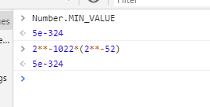


用IEEE754标准具体看JS中的Number类型。


<!-- more -->

---


本文参考了MDN的js primitive type中的[number type](https://developer.mozilla.org/en-US/docs/Web/JavaScript/Data_structures#Primitive_values)，想自己思考可以直接看。


首先JS使用的是64位IEEE754标准，根据标准，有1位符号位、11位指数和52位尾数。


JS的Number type给定范围是($-(2^{53}-1),2^{53}-1$)，当然给定的是安全的整数范围。

让我们来看看为什么是这个范围。

根据IEEE754规定，对于规格化数，存储时省略了小数点前面的1，所以可以精确表示的范围是首位是1然后52个0，到首位是1然后52个1（此时指数值应该为52，暂不考虑偏移）；然后将指数值化为更小的指数，并且尾数越界部分置0，此时可假设尾数后移一位，这样可看做表示数的范围是从首位是0然后52个0，到首位是0然后52个1。

因此表示的范围就是如此。

JS中有两个常量`Number.MAX_SAFE_INTEGER`和`Number.MIN_SAFE_INTEGER`给出的正是能够安全表示的上下界。也有一个函数`Number.isSafeInteger()`用于判断某个数是否安全。对于这个界限之外的无法精确表示的只能粗略表示，**毕竟尾数不够了**。

对于在安全表示界限数之外的，JS给出了解决方案，即使用BigInt类型，可以使用构造函数创建实例或者加后缀n。
比如
```javascript
let big=2n**70n;//1180591620717411303424n
```

+/-Infinity和NaN表示也如同IEEE754标准一样，指数部分全1（考虑偏移）：尾数部分全0则Infinity，正负看符号；尾数部分非全0则NaN。

另外，JS也有两个常数表示能够表示的最大和最小数：`Number.MAX_VALUE`和`Number.MIN_VALUE`。其中最大数是比Infinity小点的数，它的二进制表示是指数除了最低一位是0其他全1，尾数全1；最小数则是最接近0的数，即指数全0（考虑偏移），尾数最低位为1其他全0，计算结果如图，偏移在上次[浮点数博客](/2019/03/03/float-think/)中讲过，即$\lfloor\frac{2^{EMax}-1}{2}\rfloor$，比如11位指数，中间数就是$\lfloor\frac{2^{11}-1}{2}\rfloor=1023$。。




